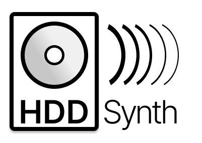
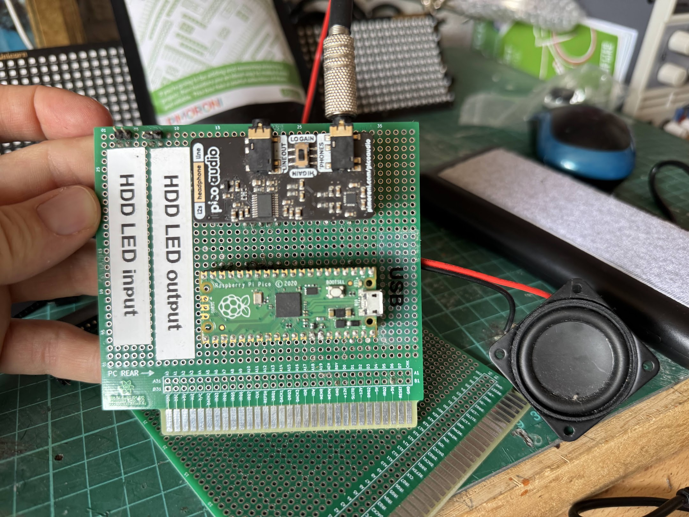

## HDD Synth

Recreate the sound of mechanical spinning HDDs on retro PCs that use a solid state drive.

Inspired by seeing the HDD Clicker project and wanting to more faithfully recreate the sound of old mechanical hard drives spinning up and accessing data. Because the hard drive sounds come from samples, it's possible to replace them with any hard drive recording you'd like or something completely different!

## Media
### Prototype ISA board: August 2025

### Prototype board: August 2025

### Proof of concept: July 2022

<!--
## Usage

## License
-->

## Contact
Peter Bridger at [maverickuk@gmail.com](maverickuk@gmail.com)

## Acknowledgments
Inspired by the [HDD Clicker project](https://www.serdashop.com/HDDClicker)
