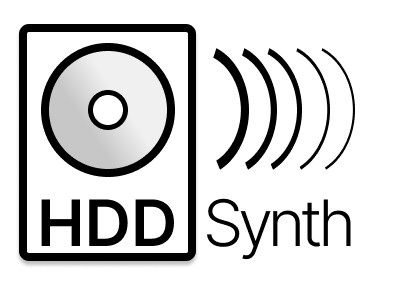
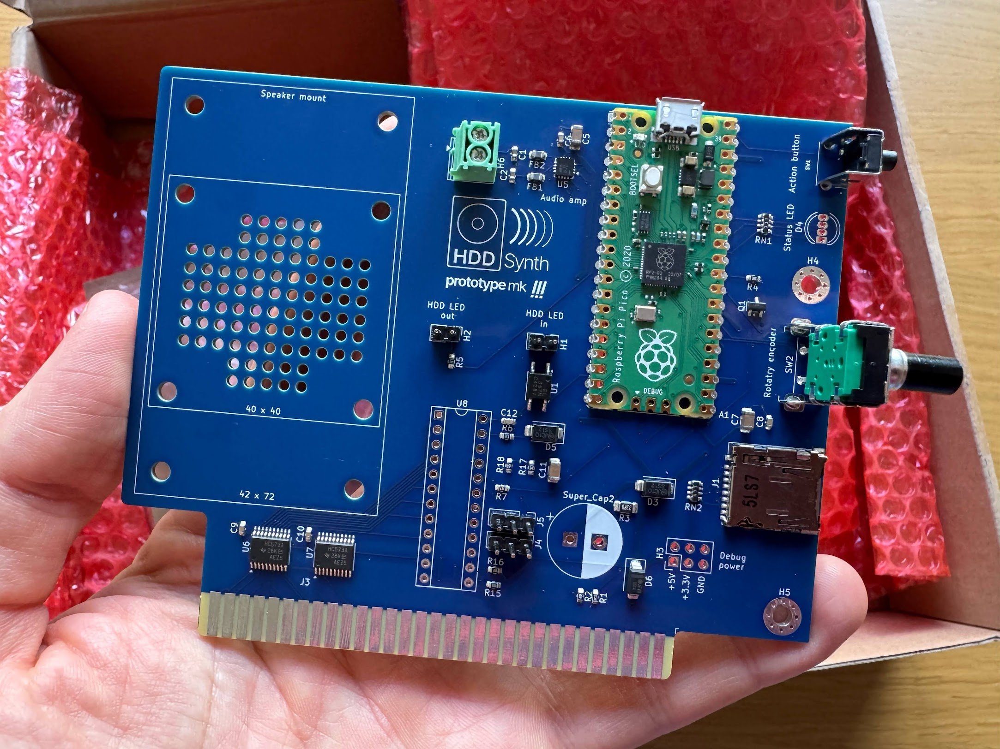

# HDD Synth

  

### Recreates the sound of mechanical spinning HDDs on retro PCs that use a solid state drive.

Inspired by seeing the HDD Clicker project and wanting to more faithfully recreate the sound of old mechanical hard drives spinning up and accessing data. Because the hard drive sounds come from samples, it's possible to replace them with any hard drive recording you'd like or something completely different!

  

## Features

- **Sample based recreation** of mechanical hard disk drives operating sounds
 - **Spin up** when PC is turned on
 - **Idle hum** whilst standing by
 - **Access** clicks and crackcles
 - **Spin down** when PC is turned off
- **SD card** to hold multiple HDD sample packs, to recreate the sound of different mechanical hard disk drives
- **Volume control** to make it very loud or silent
- **Balance** to alter the amount of idle to access sounds
- **CompactFlash adapte**r to act as full HDD replacement
- **HDD detection** via HDD LED

## Progress
### ✅ [Phase 1: Breadboard prototype](1_breadboard/README.md) 
### 🔄 Phase 2: PCB prototypes
#### [MKI prototype](2_prototype_mk1/)
Initial ISA PCB test

#### [MKII prototype](2_prototype_mk2/) 
Adds volume control, ability to change sample pack, spin down

#### [MKIII prototype](2_prototype_mk3/) 
Adds ISA based HDD detection, metal back bracket, external status LED, 3.5" drive bay adapter kit, balance (between access and idle sound)

#### [MKIV prototype](2_prototype_mk4/) 
Smaller and more cost effective than the MKIII. Adds a CompactFlash adapter so can act as full HDD replacement. Headless by default, optional controls and OLED screen can be added

### 🌱 Phase 3: PCB final 
*Awaiting completion of prototyping stages*

## Media
[View gallery](media.md)

<!--
## Usage

## License
-->

## Contact
Peter Bridger at [maverickuk@gmail.com](maverickuk@gmail.com)

Project website at [www.strifestreams.com/hddsynth](https://www.strifestreams.com/hddsynth)

## Resources
- [ISA System Architecture by Tom Shanley](https://archive.org/details/ISA_System_Architecture)
- [Intel ISA Bus Specification](https://archive.org/details/bitsavers_intelbusSpep89_3342148)
- [ISA bus technical summary](http://wearcam.org/ece385/lecture6/isa.htm)

## Acknowledgments
- Inspired by the [HDD Clicker project](https://www.serdashop.com/HDDClicker)
- A big thanks to [Ian Scott of PicoGUS fame](https://picog.us/) for sharing his resource sources and knowledge of using the Pi Pico with the ISA bus which gave me the confidence to take this project to the next level
- [Marten Electric](https://www.martenelectric.cz/) for the excellent ISA prototyping boards which made it very easy to wire up the Pico to my computer

### PCBWay
Thanks to [PCBWay](https://www.pcbway.com) for their PCB manufacturing and assembly services. This is my first PCB based project and they've been a great way to get quality PCB prototypes created along with component assembly at competitive prices. Recommended if you're thinking about creating a simular project yourself.

## License
This project is licensed under the GNU General Public License v3.0.

- **Permissions:** Commercial use, modification, and distribution are allowed.
- **Conditions:** You must include a copy of the license and the source code for any derivative works.
- **Prohibitions:** You cannot close the source or use a different license for derivative works.