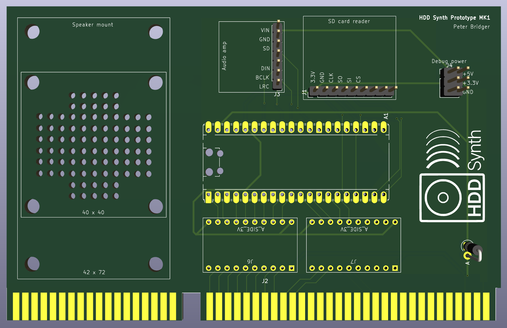

# HDD Synth media

## Phase 2: PCB prototype

KiCad 3D render of MK1 prototype board

KiCad PCB layout of MK1 prototype board

## Phase 1: Breadboard prototype

### Powered ISA board
Initial prototype of an ISA board that can be mounted within the PC to draw power from the ISA +5v rail

### HDD LED detection prototype board
Using detection of the PC HDD controller activity LED voltage to detect activity and drive the HDD Synth

### Audio samples proof of concept
Not connected to a PC, but purely to validate if the Pi Pico could produce a convincing sounding HDD subsitution. I'd say it does!

